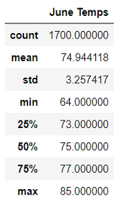
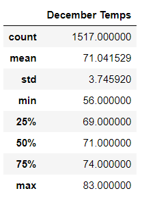
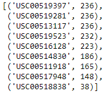
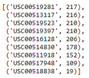
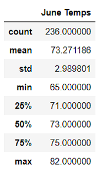
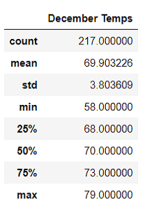

# Surfs Up Analysis
## Overview
In this project, we used Jupyter Notebook for our weather analysis in Oahu and explored Weather Data which was stored in a SQLite database. We generated the summary and used Flask to display the results in a webpage. We also finished two summary statistics in the challenge.

The following tasks were completed in the challenge.
1. Determine the Summary Statistics for June.
2. Determine the Summary statistics for December.

## Resources
-	Data Source: hawaii.sqlite
-	Software: Python 3.7.6, Visual Studio Code, 1.52.1

## Results
Table 1 presented the summary statistics for June, and table 2 presented the summary statistics for December.

Table 1 Summary Statistics for June

Table 2 Summary Statistics for December

Our results indicated that:
- The number of temperature observations in June was larger than that in December. There were 1700 total temperature observations in June and 1517 in December.
- The average temperature in June was higher than that in December. The average temperature in June was 74.94 and the average temperature in December was 71.04. There was 3.9 difference.
- The temperature range in December was larger than that in June, which means that the weather varied more in December. The temperature range in June was [64.0, 85.0] and the range in December was [56.0, 83.0].

## Summary
Our statistical summary stated that the number of temperature observations in June was larger than that in December; the weather was hotter in June; and the weather changed more in December.

Besides the above results, we also finished two additional queries.

Firstly, we would like to see the station activity in contribution to the temperature observations. Table 3 was the list of the stations and the counts in descending order for temperature observations in June, and Table 4 was the list of the stations for temperature observations in December. 

Table 3 Stations for Observations in June

Table 4 Stations for Observations in December

Our results indicated that the station USC00519281 provided the most observations for June and December. Therefore, we chose to use the statistical summaries of station USC00519281 to confirm our pervious results.

Secondly, we finished two statistical summaries for station USC00519281. Table 5 was the statistics for June and table 6 was the statistics for December.

Table 5 Summary Statistics for June at Station USC00519281

Table 5 Summary Statistics for December at Station USC00519281

The temperature at station USC00519281 was lower than the temperature result including all stations. But the temperature trend and change results remained the same as the ones using the data of all stations.